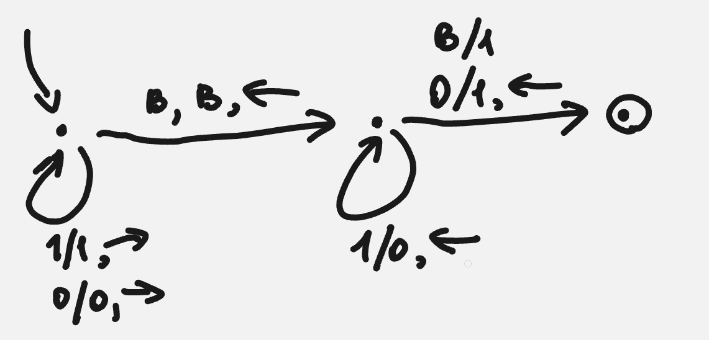
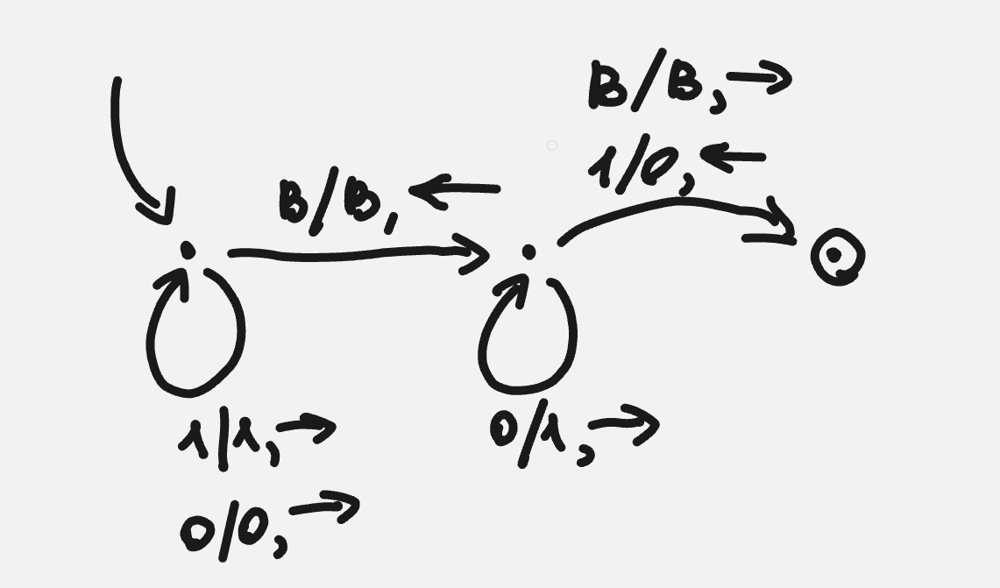
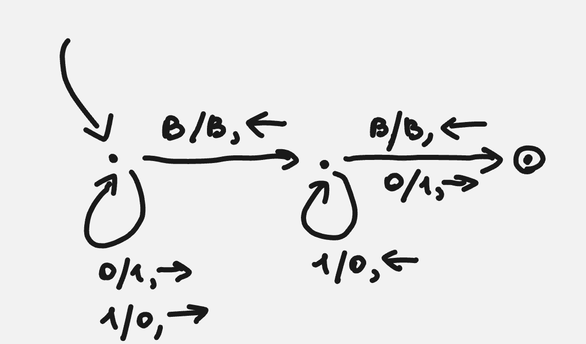
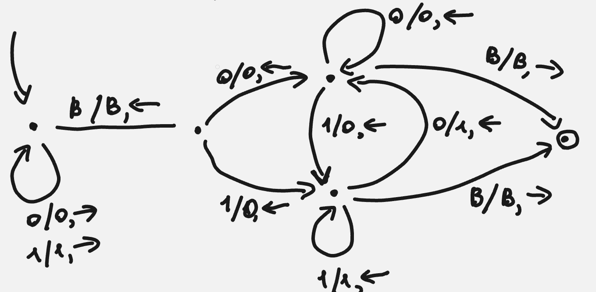
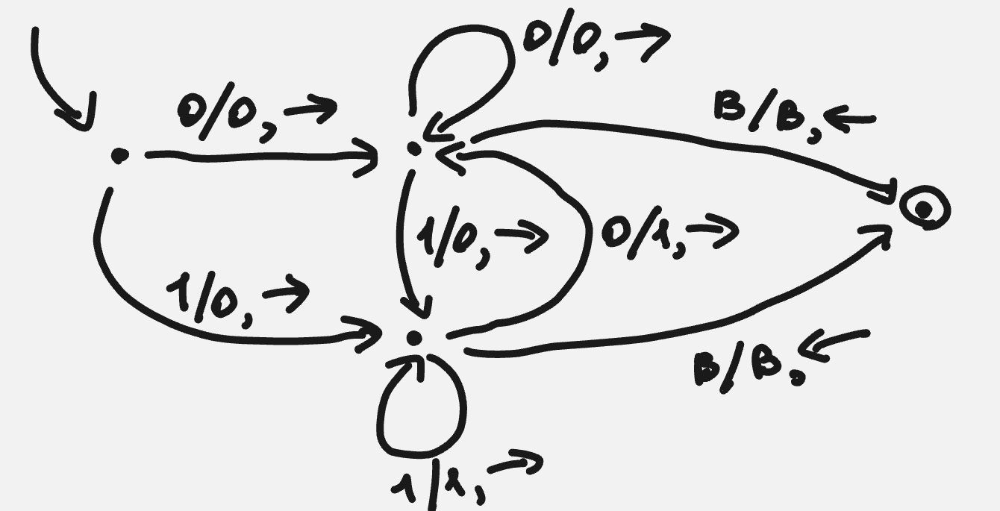
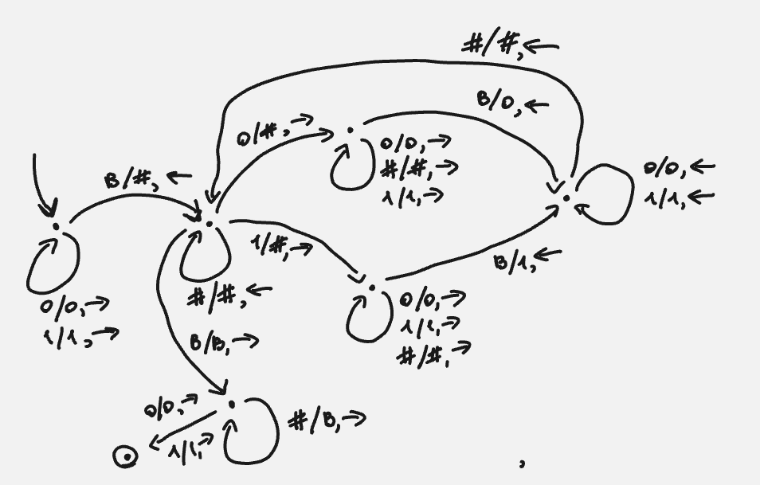
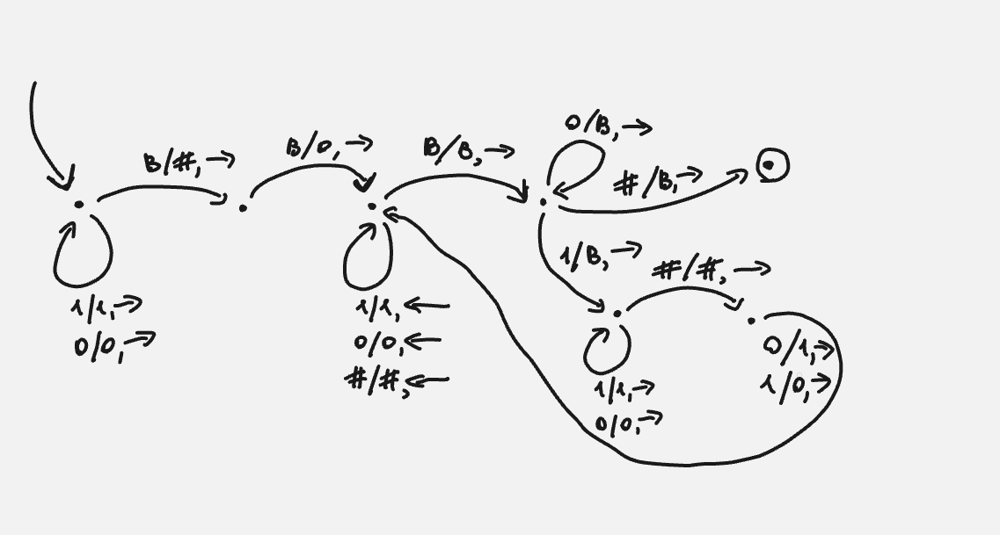
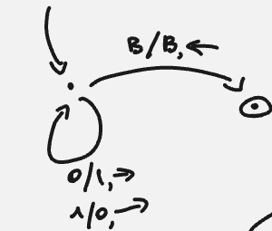
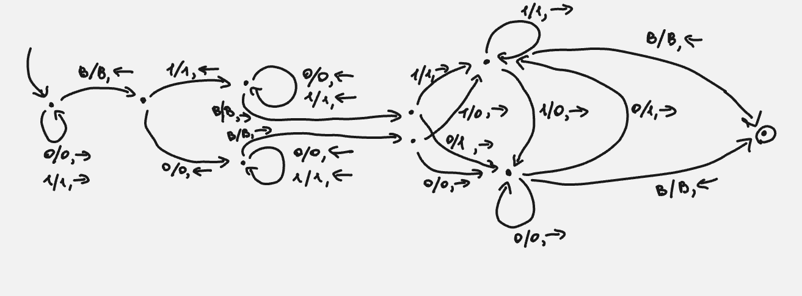
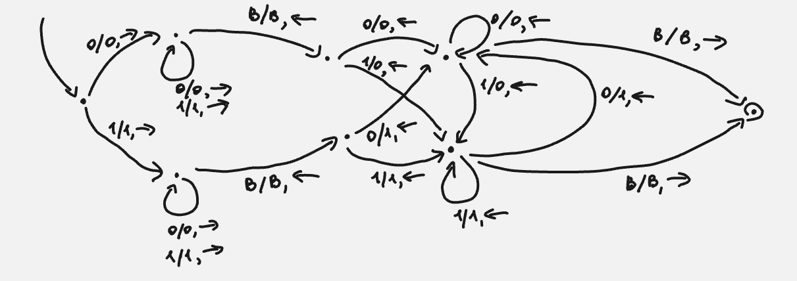

В рассматриваемых ниже машинах входной алфавит (Q) - {0, 1}, алфавит ленты (T) - {0, 1, B} + в некоторых машинах добавляется символ-разделитель (#). В момент запуска машины головка указывает на самый левый символ слова. Число (слово) записано так, что самые старшие биты идут в начале (самые левые) (aka BigEndian).

1. Incr
	
2. Dec
	
3. Neg (как я понял это умножение на -1 в дополнительном коде, т.е. инверсия + incr(1))
	
4. Shl (сдвиг влево)
	
5. Shr (сдвиг вправо)
	
6. rev (битовый реверс)
	
7. Pf (бит черности - четность количества единичных бит в числе)
	
8. inv
	
9. ror (циклический сдвиг вправо)	
	
10. rol (циклический сдвиг влево)
	
