# Определение автоматов и подобных машин (допишу позже)
Почти полностью есть в билетах. Если помните их, скорее всего, это вам не пригодится 

1. ДКА
	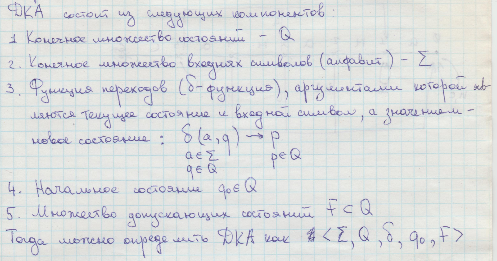
2. НКА
    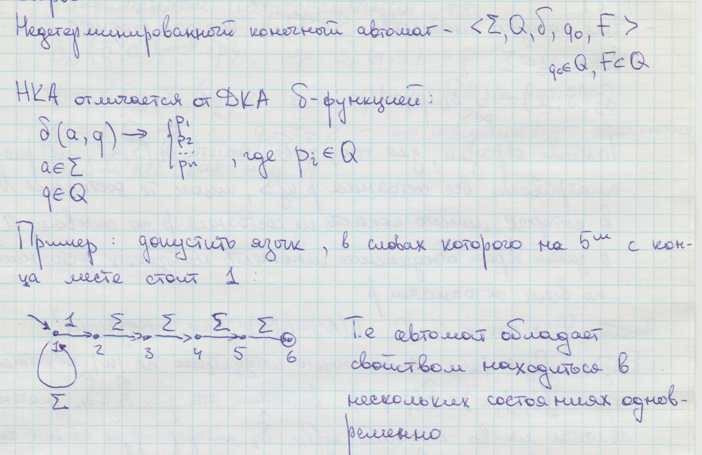
3. ДКА с регистром
    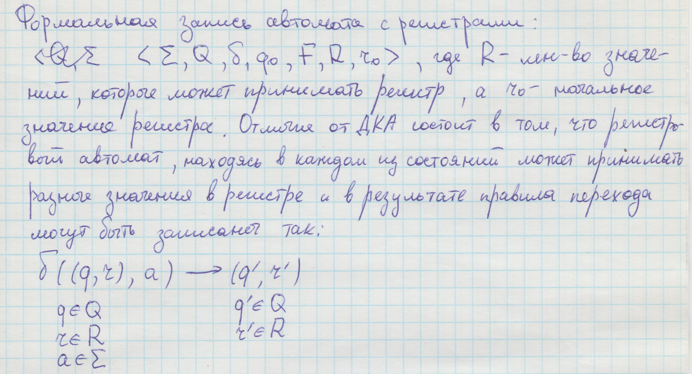

Формальная запись МП
    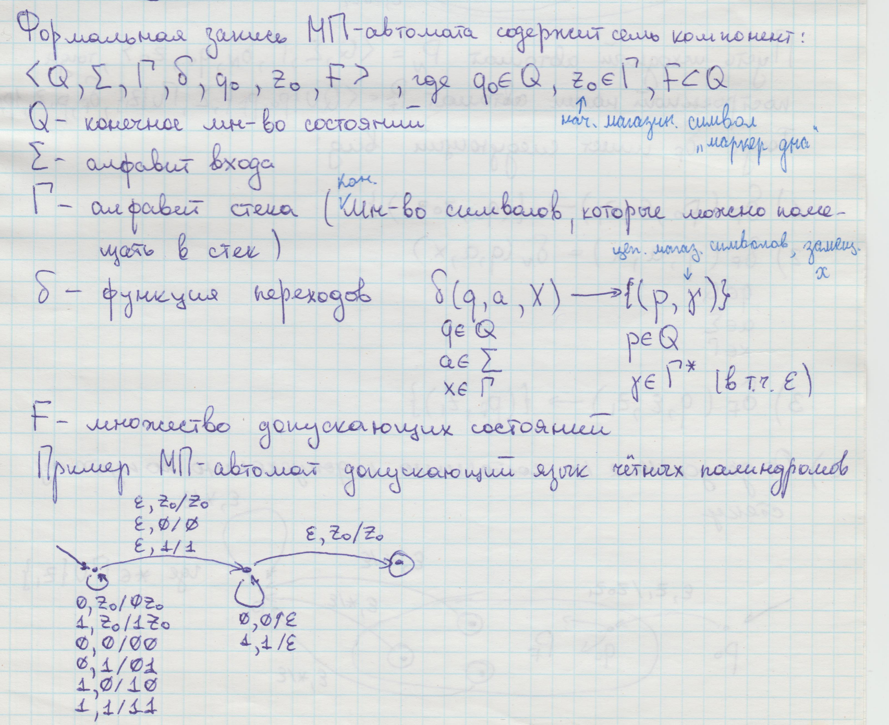

4. МП-автомат, допускающий по заключительному состоянию
    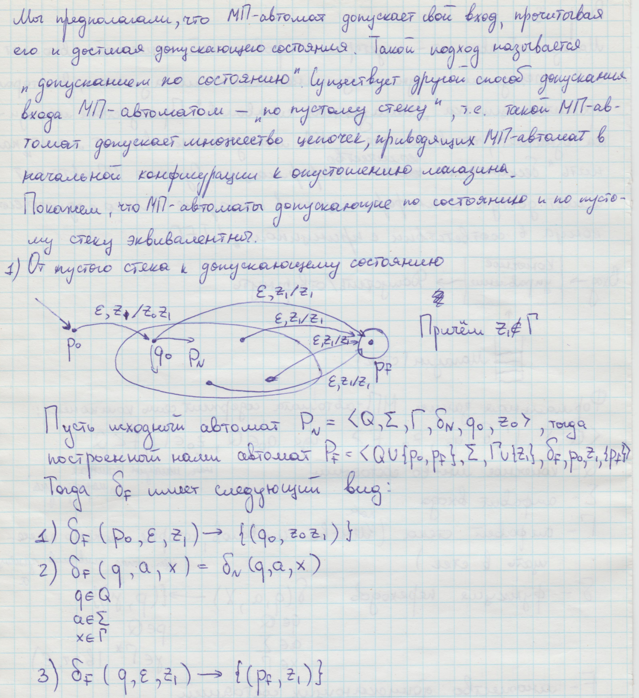
5. МП-автомат, допускающий по пустому магазину
    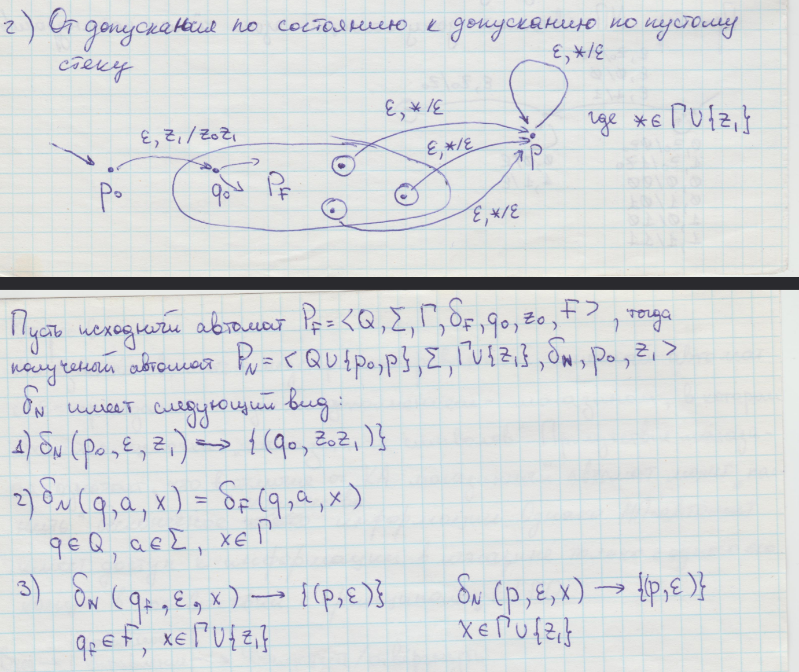

Формальная запись ДМП
    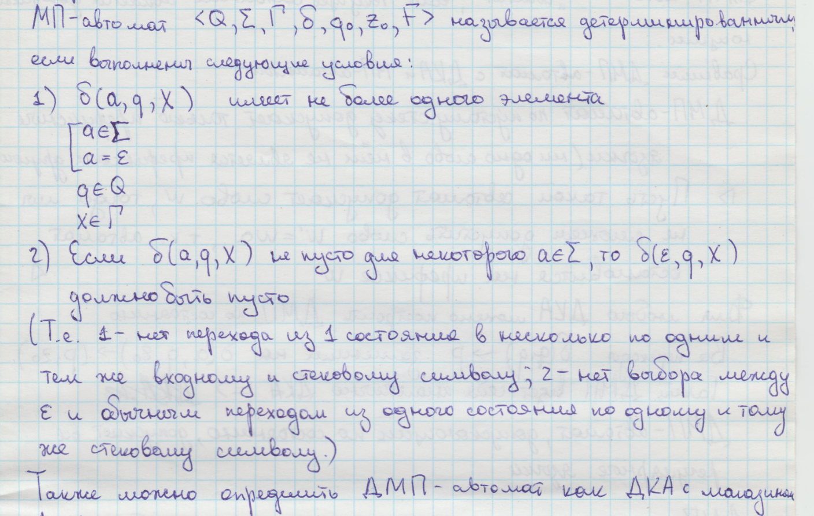
6. ДМП-автомат, допускающий по заключительному состоянию
    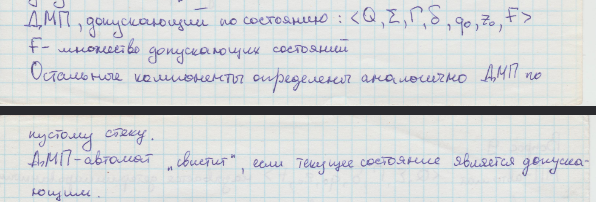
7. ДМП-автомат, допускающий по пустому магазину
    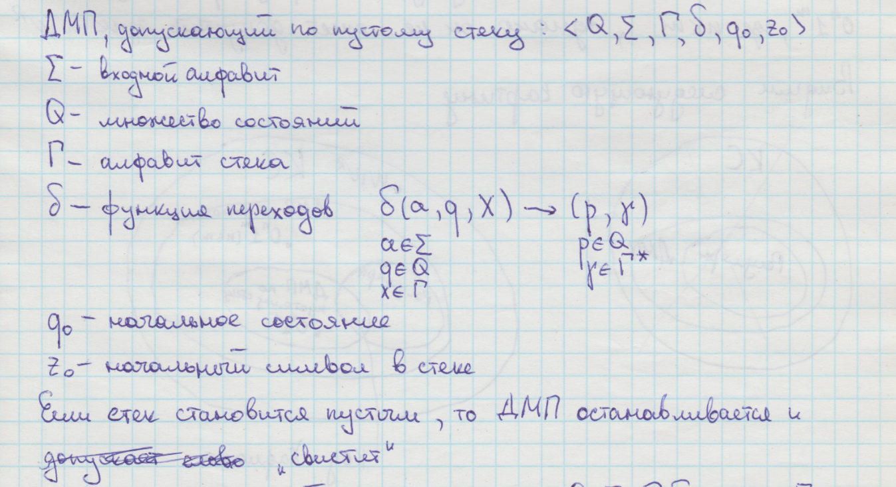
8. k-ДМП-автомат, допускающий по пустому магазину (тут хз)
    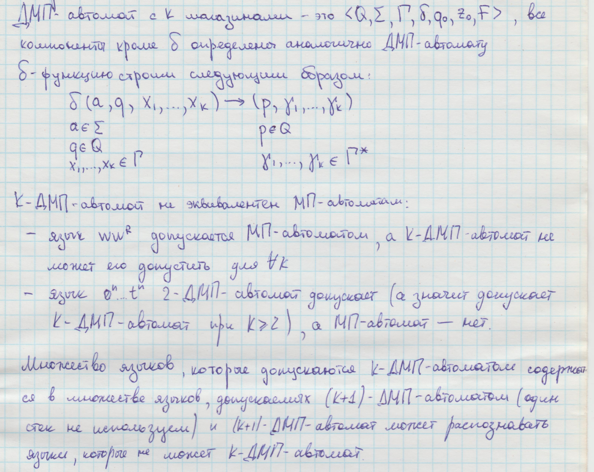
9. 2-МП-автомат
    

10. k-счётчиковая машина
    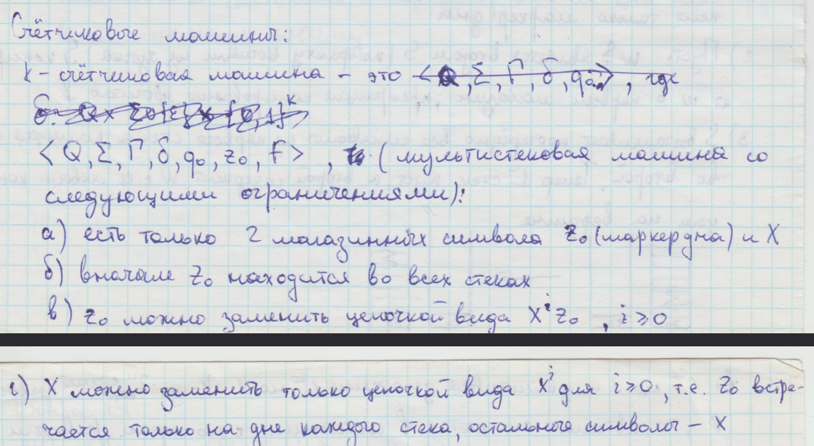
11. MT
    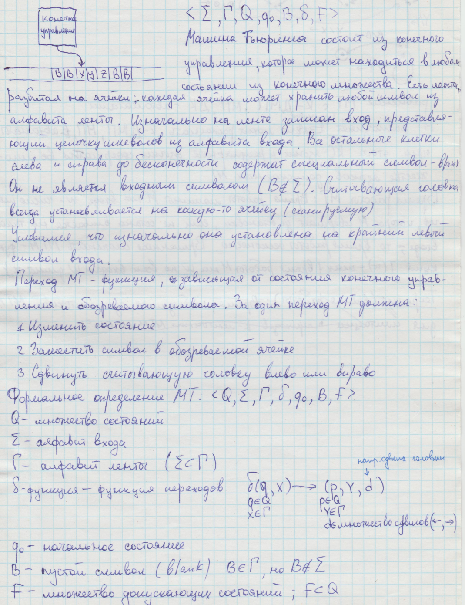
12. МТ с k-дорожечной лентой (12 билет, 28 страница)
    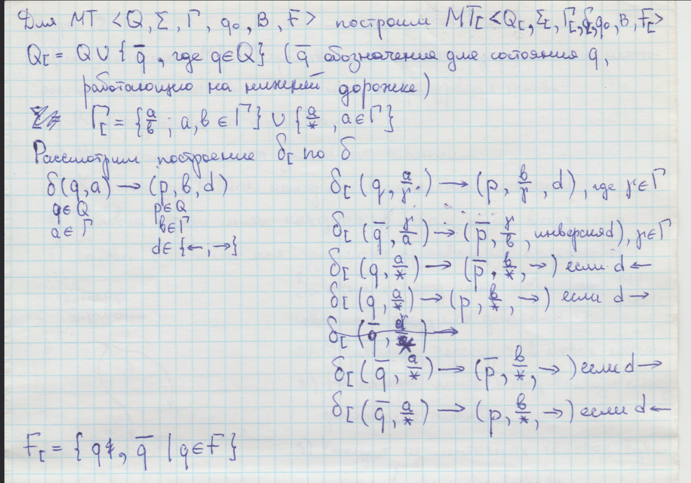
13. k-ленточная МТ
    
14. МТ с регистром
    