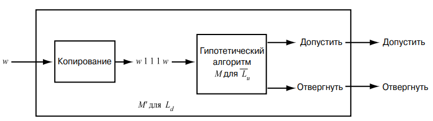
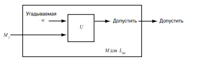

- $L_p = \lbrace{p \mid \text{p - простое}\rbrace}$ ???
	- Не до конца понял, что тут хотят услышать, язык-то очевидно рекурсивный
	- Самый тупой алгоритм - взять n и перебрать все числа от 1 до $\sqrt n$. Если ни на что не делится - допускаем. Если делится - отвергаем
- $L_u = \lbrace{(M, w) | \text{ M — код МТ }, w \in L(M)\rbrace}$
	- Не рекурсивен. Пусть $L_u \in P$, тогда его дополнение тоже рекурсивно, и, следовательно, есть допускающая его МТ M, которая останавливается на всех входах. Тогда следующая машина останавливается всегда и допускает язык $L_d$, что невозвожно (см. док-во ниже)

		

- $L_h = \lbrace{(M, w) | \text{ M - код МТ, причем M останавливается на w} \rbrace}$
	- Не рекурсивен. Пусть существует $M_H$, всегда останавливается, и $L(M_H) = L_H$. Рассмотрим машину M', которая принимает пару (код МТ M, w), подает ее на вход $M_H$, а затем, если M останавливается на w, то подает эту пару универсальной машине U (самой обычной, она теперь точно остановится), а если нет - M' останавливается и не допускает
		- получили универсальную машину, которая всегда останавливается, что невозможно.
- $L_d = \lbrace{w |\text{ w - код МТ M, причем w} \notin L(M)\rbrace}$
	- Допустим, что $L_d = L(M)$ для некоторой МТ M. Выясним теперь, принадлежит ли код машины M $w_i$ языку $L_d$.
		- Если $w_i \in L_d$, то M допускает $w_i$ . Но тогда (по определению $L_d$) $w_i$ не принадлежит $L_d$, так как $L_d$ содержит лишь такие $w_j$ , для которых $M_j$ не допускает $w_j$ .
		- Точно так же, если $w_i$ не принадлежит $L_d$, то $M_i$ не допускает $w_i$. Но тогда (по определению $L_d$) $w_i$ принадлежит $L_d$. Поскольку $w_i$ не может одновременно и принадлежать, и не принадлежать $L_d$, приходим к противоречию с нашим предположением о том, что M существует
	- Таким образом, Ld не является рекурсивно-перечислимым языком. †
- $L_e = \lbrace{w | \text{w - код МТ M, причем L(M)} = \varnothing\rbrace}$
	- Не РП, как дополенение языка $L_{ne}$, который РП, но не Р
- $L_{ne} = \lbrace{w | \text{ w - код МТ M, причем L(M)} \neq \varnothing \rbrace}$
	- Рекурсивно-перечислим. Перебирем все возможные входы w для данной машины $M_i$ с помощью енумератора (начинаем с 0 и увеличиваем, каждый раз порождая новую универсальную МТ U, независимо от того, как работает предыдущая (недетерменизм, you know?)) . Если U допускает, то $L(M_i)$ не пуст, и $M_i$ входит в $L_{ne}$

		

	- Не рекурсивен. Допустим, существует $M_{ne}$, которая допускает $L_{ne}$ и всегда останавливается. Рассмотрим машину Z, которая получает на вход слово x, отбрасывает его, и подает "зашитую" в нее пару (код МТ M, w), на вход универсальной машине U. Тогда если эта пара $\in L_u,$ то Z допускает любое слово, иначе - пустой язык.
		- Таким образом, взяв пару (код МТ M, w), построив для нее машину Z, и подав этот код нашей **всегда останавливающейся** $M_{ne},$ мы получили универсульную машину U (если язык не пустой, то $w \in L(M)$, иначе - пара $\notin L_u$), которая всегда останавливается, что невозможно (по факту, мы свели проблему $L_u$ к проблеме $L_{ne}$)
