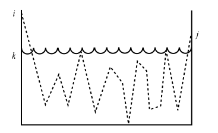

По сути это половина доказательства эквивалентности РВ и ДКА.    
Надеюсь, что обратное доказательство всем читающим покажется (или уже) тривиальным.   
Итак, пусть дан некоторый ДКА (<Q, E, f, q0, F> = A). Для начала пронумеруем все состояния от 1 до n, где n = |Q|. 

Обозначим через Rij(k) регулярное выражение, язык которого состоит из множества меток w путей, ведущих от состояния i к состоянию j автомата А и не имеющих промежуточных состояний с номерами больше k. Заметим, что начальная и конечная точки пути не являются “промежуточными”, поэтому мы не требуем, чтобы i и/или j были меньше или равны k.

Условия, налагаемые на пути выражениями Rij(k ) , представлены на рисунке. Здесь на вертикальной оси расположены состояния, начиная с 1 внизу до n вверху, а горизонталь ая ось представляет движение вдоль пути. Заметим, что на этой диаграмме показан случай, когда i и j больше, чем k, но любое из этих чисел, или оба, могут быть меньше или равны k. Также обратите внимание на то, что путь дважды проходит через вершину k, но только в крайних точках поднимается выше, чем k.

Для построения выражения Rij(k) используют следующее индуктивное определение, которое начинается с k = 0 и достигает k = n. Заметим, что при k = n пути ничем не ограничиваются, поскольку нет состояний с номерами, которые больше, чем n. Таким образом L(A) = U Rij(n), где i∈ 1:n, qj ∈ F

**Базис**. В качестве базиса примем k = 0. Поскольку все состояния пронумерованы от 1 и далее, то это условие означает, что у пути вообще нет промежуточных состояний. Существует только два вида путей, удовлетворяющих такому условию. 
1.Дуга, ведущая от вершины (состояния) i к вершине j.
2.Путь длины 0, состоящий лишь из некоторой вершины i (то есть петля)
Если i ≠ j, то возможен только первый случай. Необходимо проанализировать данный ДКА А и найти такие входные символы а, по которым есть переход из состояния i в состояние j:
а) если таких символов нет, то Rij( 0) = ∅;
б) если существует только один такой символ a, то Rij( 0) = a;
в) если существуют такие символы a1, a2, …, ak, которыми помечены дуги из
состояния i в состояние j, то Rij(0) = a1 + a2 + … + ak.
В то же время, если i = j, то допустимыми путями являются путь длины 0 и все петли, которые начинаются и заканчиваются в состоянии i. Путь длины 0 может быть представлен регулярным выражением ε, потому что вдоль этого пути нет символов. Следовательно, добавляем ε к выражениям, полученным выше в пунктах (а)–(в). Таким образом, в случае (а) "нет ни одного символа" а получим выражение ε, в случае (б) "один символ а" выражение примет вид ε + a, и в случае (в) "несколько символов" получим выражение ε + a1 + … + ak

**Индукция.** Предположим, что существует путь из состояния i в состояние j, не проходящий через состояния с номерами, которые больше, чем k. Необходимо рассмотреть
две ситуации.
1. Путь вообще не проходит через состояние k. В этом случае метка пути принадлежит языку Rij( k −1) .
2. Путь проходит через состояние k по меньшей мере один раз. Тогда мы можем разделить путь на несколько частей, как показано на рис. 3.3. Первая часть ведет от состояния i к состоянию k, но не проходит через k, последняя ведет из k в j, также не проходя через k, а все части, расположенные внутри пути, ведут из k в k, не проходя через k. Заметим, что если путь проходит через состояние k только один раз, то “внутренних” частей нет, а есть только путь из i в k и путь из k в j. Множество меток для всех путей такого вида может быть представлено регулярным выражением:
   Rik(k-1)kk(k−1) )\*Rkj(k −1)). Таким образом, первое выражение представляет часть пути, ведущую в состояние k в первый раз, второе — часть, ведущую из k в k нуль или несколько раз, и третье выражение — часть пути, которая выходит из состояния k в последний раз и ведет в состояние j.

После объединения выражений для путей двух рассмотренных выше типов получим
следующее выражение для меток всех путей, ведущих из состояния i в состояние j, кото-
рые не проходят через состояния с номерами, которые больше, чем k.
Rij(k) = Rij(k −1) + Rik(k −1) (Rkk(k −1) )* Rkj(k −1)
Поскольку данные выражения строятся в порядке возрастания верхнего индекса,
можно построить любое выражение Rij(k) , так как оно зависит только от выражений с
меньшими значениями верхнего индекса.
В итоге получим Rij(n) для всех i и j. Можно предположить, что состояние 1 является на-
чальным, а множество допускающих (заключительных) состояний может быть любым. То-
гда регулярным выражением для языка, допускаемого данным автоматом, будет сумма
(объединение) всех тех выражений R1( nj ) , в которых состояние j является допускающим.

Это полное повторение из книги Хопкрофта, добавить к доказательсву особо нечего(:)   
**Замечания: **
1. Rij(0) = a1 + a2 + … + ak - вот это нужно трактовать как | (объединение языков) в контексте регулярных выражений
2. Я не совсем понял, почему в выводе базиса в хранилище получается ε|(a1|…|an)\* . Это не правда: на шаге базиса у нас может быть только один символ (точнее элемент из E), потому что переход осуществляется именно по нему, а не по цепочке из символов, которые допускает указанное выше выражение (например, a1a2 - у нас нету такого слова при отсутствие промежуточных состояний). С другой стороны я как-то не понял, как автор доказательства выше учитывает петли при i=j (хотя и упоминает). Как будто бы нужно добывать звезду клини ко всем символам с петлями: (я не заню, как это нормально показать, поэтому скажем, что первые k состояний с петлями; тогда  Rij(0) = ε|a1\*|…|ak\*|a(k+1)|...|an